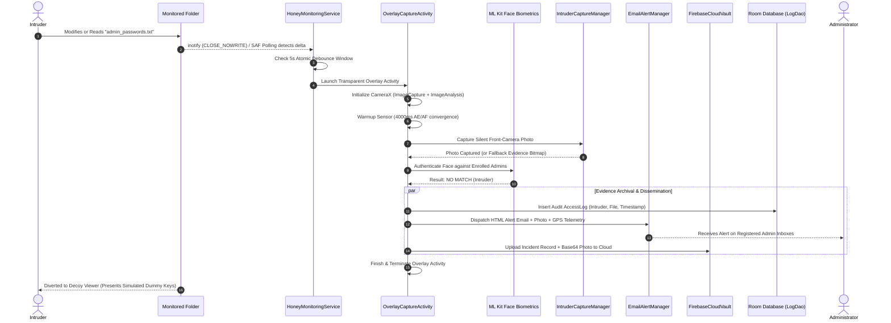

# 🛡️ Honeyfile Security — Deception & Intrusion Detection System

<p align="center">
  
</p>

<p align="center">
  <b>Next-Generation Honeypot Deception Engine, Biometric Facial Verification, and Real-Time File Integrity Surveillance for Android</b>
</p>

<p align="center">
  
  
  
  
  
</p>

---

## 📑 Table of Contents

1. [Executive Overview](#-executive-overview)
2. [Key Architectural Highlights & Capabilities](#-key-architectural-highlights--capabilities)
3. [Deception & Honeypot Philosophy](#-deception--honeypot-philosophy)
4. [Detailed System Architecture](#-detailed-system-architecture)
   - [1. Biometric Facial Authentication Subsystem](#1-biometric-facial-authentication-subsystem)
   - [2. Dual-Engine Directory & Integrity Surveillance](#2-dual-engine-directory--integrity-surveillance)
   - [3. Background Surveillance & Stealth Camera Engine](#3-background-surveillance--stealth-camera-engine)
   - [4. Intruder Evidence Capture & Forensic Vault](#4-intruder-evidence-capture--forensic-vault)
   - [5. Alert Dispatch & Forensic Device Telemetry](#5-alert-dispatch--forensic-device-telemetry)
   - [6. Cloud Vault Synchronization (Firestore & Auth)](#6-cloud-vault-synchronization-firestore--auth)
   - [7. Threat Analytics & Temporal Heatmap Intelligence](#7-threat-analytics--temporal-heatmap-intelligence)
   - [8. Room Database Audit Logging & CSV Export](#8-room-database-audit-logging--csv-export)
   - [9. In-Place Theme Engine (Zero-Recreation Dark/Light Mode)](#9-in-place-theme-engine-zero-recreation-darklight-mode)
5. [End-to-End Execution Flow (Sequence Diagram)](#-end-to-end-execution-flow)
6. [User Interface & Dashboard Walkthrough](#-user-interface--dashboard-walkthrough)
7. [Directory Structure & Code Map](#-directory-structure--code-map)
8. [Data Models & Schema Reference](#-data-models--schema-reference)
9. [Android Permissions & Security Policies](#-android-permissions--security-policies)
10. [Setup, Build & Deployment Guide](#-setup-build--deployment-guide)
11. [Configuration & Environment Parameters](#-configuration--environment-parameters)

---

## 🌟 Executive Overview

**Honeyfile Security** is an advanced endpoint security and deception engineering application designed for Android devices. Operating on the principle of **cyber deception (Honeypotting)**, the application deploys enticing decoy files (*honeyfiles*) containing simulated confidential information (such as root passwords, secret API keys, and executive payroll sheets) into monitored storage locations.

When unauthorized personnel or malicious processes attempt to access, modify, copy, rename, or delete these files:
- The system **diverts the intruder** to a realistic decoy viewer without alerting them to the breach detection.
- The **stealth front camera engine** silently captures a high-resolution facial photograph of the perpetrator.
- The **facial biometric engine** compares the captured image against enrolled Administrator profiles using on-device Machine Learning (ML Kit).
- The system collects **forensic device telemetry** (GPS location, Wi-Fi SSID, local IPv4, and battery state).
- An encrypted **HTML security alert email** containing the intruder's photo and exact location is dispatched immediately via SMTP.
- The incident and evidence are mirrored instantly to a **Firebase Cloud Firestore Vault** to prevent evidence destruction.
- All events are permanently recorded in a local **Room Audit Database** and analyzed for threat scoring, peak attack windows, and hourly heatmaps.

---

## 🚀 Key Architectural Highlights & Capabilities

| Feature Area | Technical Implementation | Security Advantage |
| :--- | :--- | :--- |
| **Facial Biometrics** | Google ML Kit Face Detection + Landmark Geometry Ratio Analysis | On-device, sub-second facial authentication; prevents cloud latency and maintains privacy. |
| **Dual Admin Slots** | Independent Administrator profiles (Admin 1 & Admin 2) with distinct facial templates & emails | Multi-administrator governance; anti-impersonation cross-validation. |
| **Hybrid Surveillance** | Android SAF Polling (every 500ms) + Native Linux `inotify` (`FileObserver`) | Instant microsecond kernel detection for file reads (`CLOSE_NOWRITE`) and file writes. |
| **Stealth Background Capture** | Zero-UI transparent activity (`OverlayCaptureActivity`) with headless `ImageAnalysis` session | Bypasses Android background camera restrictions silently without UI flashing or notification popups. |
| **Dual Deception Flow** | Split navigation: Verified Admin $\to$ Real Master File; Intruder $\to$ Decoy Document | Intruder remains unaware of detection while active forensic capture takes place. |
| **Forensic Telemetry** | GPS Geolocation, Maps URL, IPv4 address, Wi-Fi SSID, Battery level & charging state | Complete situational awareness for enterprise forensic investigations. |
| **Multi-Tier Email Alert** | JavaMail SMTP (TLS/SSL `smtp.gmail.com:465`) with CID inline image embedding | Real-time off-device notification delivered to all registered administrator inboxes. |
| **Off-Device Cloud Sync** | Firebase Anonymous Auth + Cloud Firestore document payload (Base64 JPEG) | Tamper-proof remote log persistence even if the local device is compromised or formatted. |
| **Threat Intelligence** | Dynamic 0–100 Threat Index, 6-slot 24h temporal heatmap, custom canvas donut chart | Real-time attack velocity analytics and risk categorization (Low, Elevated, Critical). |
| **High-Performance UI** | Coil 2.6.0 async image pipeline, `ListAdapter` + `DiffUtil`, in-place theme animator | 60 FPS scrolling, zero main-thread bitmap decoding jank, instant theme switching without activity restarts. |

---

## 🍯 Deception & Honeypot Philosophy

Traditional mobile security relies on access control barriers (passwords, PINs, biometric locks) that inform an intruder when access is blocked. **Honeyfile Security** utilizes an active deception strategy:

```
                              [ Target Directory Monitored ]
                                            │
                                            ▼
                      [ User / Process Interacts with Honeyfile ]
                                            │
                                            ▼
                         [ Background Camera Silent Capture ]
                                            │
                                            ▼
                           [ ML Kit Facial Ratio Verification ]
                                            │
                     ┌──────────────────────┴──────────────────────┐
                     ▼                                             ▼
             [ MATCH: Admin ]                             [ NO MATCH: Intruder ]
                     │                                             │
      • Access Granted                               • Diverted to Decoy Viewer
      • Open Real Confidential File                  • Generate Tamper Alert
      • Log "Authorized Access"                      • Gather Telemetry (GPS, IP, Wi-Fi)
                                                     • Dispatch SMTP Email with Photo
                                                     • Sync to Cloud Firestore Vault
                                                     • Increment Threat Score
```

### Deployed Decoy Profiles
Administrators can deploy pre-packaged decoy files directly into any selected directory:
1. `admin_passwords.txt` — Realistic system root credentials and database connection strings.
2. `salary_records.xlsx` — Executive salary and disbursement payroll data.
3. `secret_api_keys.json` — Simulated AWS root keys and Stripe live tokens.

---

## 🏗️ Detailed System Architecture

```
com.honeyfile.security
 ├── alert/         --> SMTP JavaMail Dispatcher & Device Telemetry Manager
 ├── analytics/     --> Threat Scoring, 24h Window Calculation & Heatmap Engine
 ├── auth/          --> ML Kit Facial Biometrics, Geometric Ratio Matcher & Theme Manager
 ├── camera/        --> CameraX Silent Capture & Transparent Background Overlay
 ├── cloud/         --> Firebase Firestore Cloud Vault Synchronizer
 ├── data/          --> Room Database, AccessLog Entity & LogDao
 ├── integrity/     --> inotify FileObserver, SAF Path Resolver & Alteration Types
 ├── scanner/       --> Continuous Directory Delta Polling & Keyword Engine
 ├── service/       --> HoneyMonitoringService Foreground Surveillance Service
 └── ui/            --> Activities, Dialog Fragments, RecyclerView Adapters & Custom Views
```

---

### 1. Biometric Facial Authentication Subsystem
*Source: [`FaceAuthManager.kt`](app/src/main/java/com/honeyfile/security/auth/FaceAuthManager.kt)*

```
                       [ Captured Frame Bitmap ]
                                   │
                                   ▼
                   [ ML Kit FaceDetection.getClient() ]
                                   │
                    (Detect Face Landmarks & Bounds)
                                   │
             ┌─────────────────────┴─────────────────────┐
             ▼                                           ▼
   [ Left / Right Eye Positions ]               [ Nose Base Position ]
             │                                           │
             └─────────────────────┬─────────────────────┘
                                   │
                                   ▼
                    [ Compute Scale-Invariant Ratios ]
               R1 = Eye_Distance / Bounding_Box_Width
               R2 = Eye_Nose_Distance / Bounding_Box_Height
                                   │
                                   ▼
                    [ Manhattan Distance Comparison ]
               Δ = |R1_captured - R1_enrolled| + |R2_captured - R2_enrolled|
                                   │
                     ┌─────────────┴─────────────┐
                     ▼                           ▼
               [ Δ < 0.12 ]                [ Δ >= 0.12 ]
              (Admin Match)                  (Intruder)
```

- **Algorithm Details:** Rather than relying on computationally heavy deep feature embeddings that require high memory overhead, the engine extracts normalized biometric proportions:
  $$\text{Inter-Pupillary Distance } (D_{\text{eyes}}) = \sqrt{(x_{\text{left}} - x_{\text{right}})^2 + (y_{\text{left}} - y_{\text{right}})^2}$$
  $$\text{Eye-to-Nose Distance } (D_{\text{eye-nose}}) = \sqrt{\left(\frac{x_{\text{left}} + x_{\text{right}}}{2} - x_{\text{nose}}\right)^2 + \left(\frac{y_{\text{left}} + y_{\text{right}}}{2} - y_{\text{nose}}\right)^2}$$
  $$R_1 = \frac{D_{\text{eyes}}}{\text{BoundingBox.Width}}, \quad R_2 = \frac{D_{\text{eye-nose}}}{\text{BoundingBox.Height}}$$
- **Anti-Impersonation Safeguards:**
  - When enrolling Admin 2, the scan is cross-checked against Admin 1 to prevent enrolling duplicate face profiles for both administrator slots.
  - Profile names and alert emails must be distinct.
  - Requires at least one active administrator profile before surveillance services can be initiated.

---

### 2. Dual-Engine Directory & Integrity Surveillance
*Sources: [`FolderScannerManager.kt`](app/src/main/java/com/honeyfile/security/scanner/FolderScannerManager.kt), [`HoneyFileObserver.kt`](app/src/main/java/com/honeyfile/security/integrity/HoneyFileObserver.kt), [`UriPathResolver.kt`](app/src/main/java/com/honeyfile/security/integrity/UriPathResolver.kt)*

The surveillance subsystem combines two complementary file system observation engines:

```
                                [ Monitored Storage Location ]
                                               │
                       ┌───────────────────────┴───────────────────────┐
                       ▼                                               ▼
        [ SAF Continuous Polling Engine ]              [ Linux Kernel inotify Observer ]
        • Frequency: Every 500ms                       • Microsecond Event Triggers
        • Uses DocumentFile.fromTreeUri                • Uses Android FileObserver
        • Tracks: Name, Size, Timestamp                • Tracks: CLOSE_NOWRITE, CREATE,
        • Detects Write Alterations:                             MODIFY, DELETE, MOVE
          - CREATED (New file detected)                • Resolves content:// to /storage/...
          - MODIFIED (Size or time delta)              • Identifies Read/Access Events
          - DELETED (File absent in scan)                without file modification
```

- **Read Detection Strategy:** Android's Storage Access Framework (SAF) does not provide read notification hooks. The app incorporates `HoneyFileObserver` listening for the Linux kernel `CLOSE_NOWRITE` mask. This allows detection when an intruder opens and reads a sensitive document without modifying its contents.
- **Keyword Filtering:** To prevent false positives caused by Android OS background indexers, gallery scanners, or backup daemons, read events are filtered against decoy naming patterns:
  `honey`, `secret`, `password`, `confidential`, `salary`, `admin`, `credential`, `private`, `decoy`, `backup`, `api_key`, `token`, `apikey`, `passwd`.
- **Path Resolution:** `UriPathResolver` decomposes SAF tree document identifiers (`primary:Documents` or volume UUIDs) into absolute Linux directory paths (`/storage/emulated/0/...`), gracefully falling back if non-standard mount paths are encountered.

---

### 3. Background Surveillance & Stealth Camera Engine
*Sources: [`HoneyMonitoringService.kt`](app/src/main/java/com/honeyfile/security/service/HoneyMonitoringService.kt), [`OverlayCaptureActivity.kt`](app/src/main/java/com/honeyfile/security/camera/OverlayCaptureActivity.kt)*

```
[ File Tamper Event Detected in Background ]
                     │
                     ▼
[ HoneyMonitoringService: Check Debounce & Foreground Status ]
                     │
                     ▼
[ Launch OverlayCaptureActivity (Theme.Transparent, Window Flags) ]
                     │
                     ▼
[ Bind CameraX: ImageCapture + Headless ImageAnalysis ]
                     │
                     ▼
[ 4000ms Sensor Warmup (AE / AF / AWB Convergence) ]
                     │
                     ▼
[ suspendCancellableCoroutine -> ImageCapture.takePicture() ]
                     │
                     ▼
[ EXIF Rotation Correction -> Save Evidence JPEG ]
                     │
                     ▼
[ Trigger Background Tasks: DB Insert -> SMTP Email -> Firestore Sync ]
                     │
                     ▼
[ Finish Activity Silently (~2 Seconds Total Lifecycle) ]
```

#### Android Background Camera Policy Compliance:
Modern Android operating systems strictly forbid background `Services` from opening the camera hardware. **Honeyfile Security** solves this through a zero-latency stealth mechanism:
1. `HoneyMonitoringService` runs as an ongoing `FOREGROUND_SERVICE_CAMERA` and `FOREGROUND_SERVICE_SPECIAL_USE`.
2. When a file alteration event occurs while the app is closed, it launches `OverlayCaptureActivity`.
3. `OverlayCaptureActivity` has no UI layout (`setContentView` is omitted), has transparent window flags (`FLAG_NOT_TOUCHABLE`, `FLAG_NOT_FOCUSABLE`, `FLAG_SHOW_WHEN_LOCKED`, `FLAG_TURN_SCREEN_ON`), and does not appear in Android Recents (`excludeFromRecents="true"`).
4. `ImageAnalysis` primes the camera HAL repeating session without a visible `PreviewView` texture surface.
5. Captures the frame, executes background persistence and alerting, and invokes `finish()` immediately.
6. A thread-safe `AtomicLong` debounce mechanism ensures rapid sequential file operations only trigger a single capture per 5-second interval.

---

### 4. Intruder Evidence Capture & Forensic Vault
*Sources: [`IntruderCaptureManager.kt`](app/src/main/java/com/honeyfile/security/camera/IntruderCaptureManager.kt), [`CapturedImageAdapter.kt`](app/src/main/java/com/honeyfile/security/ui/CapturedImageAdapter.kt), [`PhotoDetailDialogFragment.kt`](app/src/main/java/com/honeyfile/security/ui/PhotoDetailDialogFragment.kt)*

- **Capture Pipeline:**
  1. **In-Memory Capture:** Direct byte-buffer extraction from `ImageProxy` via `BitmapFactory.decodeByteArray` with rotation matrix compensation.
  2. **File Capture Fallback:** Uses `ImageCapture.OutputFileOptions` to write a temporary JPEG in `cacheDir` and applies EXIF orientation parsing.
  3. **Synthetic Evidence Generation:** If the hardware camera is blocked or in use by another app, a structured high-contrast canvas alert bitmap containing the breach timestamp and incident metadata is generated so forensic logging is never dropped.
- **Evidence Storage:** Captured evidence photos are stored in the application's private storage directory (`filesDir/captured/`) named with high-precision timestamps (`yyyyMMdd_HHmmss.jpg`).
- **High-Performance Vault UI:**
  - Integrated with **Coil 2.6.0** for asynchronous background thread bitmap decoding, memory caching (`LruCache`), and disk caching.
  - Implements `ListAdapter` with `DiffUtil` to eliminate UI stuttering when new evidence images are appended to the grid.
  - Long-press contextual actions: View Fullscreen Evidence, Export to External Storage via SAF (`CreateDocument`), and Permanent Delete.

---

### 5. Alert Dispatch & Forensic Device Telemetry
*Sources: [`EmailAlertManager.kt`](app/src/main/java/com/honeyfile/security/alert/EmailAlertManager.kt), [`TelemetryManager.kt`](app/src/main/java/com/honeyfile/security/alert/TelemetryManager.kt)*

```
                              [ Security Alert Triggered ]
                                            │
                                            ▼
                              [ Gather Device Telemetry ]
               ├── GPS Coordinates (Latitude, Longitude, Accuracy)
               ├── Google Maps Pinpoint Hyperlink
               ├── Network IPv4 Address (NetworkInterface scan)
               ├── Connected Wi-Fi SSID / Connection Type
               └── Battery Percentage & Charging State
                                            │
                                            ▼
                             [ Compose HTML Email Payload ]
               ├── Incident Subject & Severity Badge
               ├── Timestamp & Altered File Name
               ├── Formatted Telemetry Information Card
               └── Embedded JPEG Intruder Evidence Photo (CID: <intruder_photo>)
                                            │
                                            ▼
                           [ SMTP SSL Dispatch (Port 465) ]
               └── Delivered Simultaneously to all Enrolled Admin Inboxes
```

---

### 6. Cloud Vault Synchronization (Firestore & Auth)
*Source: [`FirebaseCloudVaultManager.kt`](app/src/main/java/com/honeyfile/security/cloud/FirebaseCloudVaultManager.kt)*

To safeguard audit records against local device tampering (e.g. an intruder uninstalling the app or wiping app storage), every breach incident is immediately mirrored to **Firebase Cloud Firestore**:

- **Authentication:** Uses Firebase Anonymous Authentication to establish secure, zero-friction sessions.
- **Firestore Schema (`breach_incidents` Collection):**

```json
{
  "file_name": "admin_passwords.txt",
  "action_type": "EDITED",
  "timestamp": "2026-08-18 15:45:00",
  "details": "BACKGROUND BREACH: 'admin_passwords.txt' EDITED while app closed.",
  "photo_base64": "/9j/4AAQSkZJRgABAQAAAQABAAD/2wBD...",
  "device_model": "Google Pixel 8 Pro",
  "android_version": "Android 14 (API 34)",
  "synced_at_ms": 1787046300000,
  "telemetry": {
    "latitude": 19.0760,
    "longitude": 72.8777,
    "google_maps_url": "https://maps.google.com/?q=19.0760,72.8777",
    "ip_address": "192.168.1.45",
    "wifi_ssid": "Corporate_Secure_5G",
    "battery_percentage": 87,
    "is_charging": true
  }
}
```

---

### 7. Threat Analytics & Temporal Heatmap Intelligence
*Sources: [`ThreatAnalyticsManager.kt`](app/src/main/java/com/honeyfile/security/analytics/ThreatAnalyticsManager.kt), [`ThreatSummary.kt`](app/src/main/java/com/honeyfile/security/analytics/ThreatSummary.kt), [`PieChartView.kt`](app/src/main/java/com/honeyfile/security/ui/PieChartView.kt)*

```
                            [ Historical Access Logs ]
                                        │
                                        ▼
                      [ ThreatAnalyticsManager Engine ]
                                        │
             ┌──────────────────────────┼──────────────────────────┐
             ▼                          ▼                          ▼
   [ 24h Velocity Score ]    [ Peak Attack Window ]       [ 6-Slot Heatmap ]
   • Count in last 24h       • 24-hour histogram binning  • 00:00 - 04:00 (Slot 0)
   • 0 breaches  -> 5/100    • Identifies highest         • 04:00 - 08:00 (Slot 1)
   • All-time    -> 20/100     frequency 2-hour window    • 08:00 - 12:00 (Slot 2)
   • 1-2 in 24h  -> 55/100     (e.g., "14:00 - 16:00")    • 12:00 - 16:00 (Slot 3)
   • >= 3 in 24h -> 95/100                                • 16:00 - 20:00 (Slot 4)
                                                          • 20:00 - 24:00 (Slot 5)
```

- **Interactive Risk Breakdown:** Tapping any heatmap slot or the threat card opens the **Threat Analytics Detail Dialog**, featuring a custom hardware-accelerated Donut/Pie chart (`PieChartView`) rendering real-time distribution across:
  - Authorized Admin Access (Green)
  - Intruder Access Breaches (Red)
  - File Modifications (Amber)
  - File Deletions (Purple)
  - New Files Created (Cyan)

---

### 8. Room Database Audit Logging & CSV Export
*Sources: [`AppDatabase.kt`](app/src/main/java/com/honeyfile/security/data/AppDatabase.kt), [`LogDao.kt`](app/src/main/java/com/honeyfile/security/data/LogDao.kt), [`AccessLog.kt`](app/src/main/java/com/honeyfile/security/data/AccessLog.kt)*

- **Persistence Layer:** Uses Android Room Database 2.6.1 with SQLite database `honeyfile_logs.db`.
- **Reactive Observation:** Live query streams (`LiveData`) update dashboard counters, directory lists, and threat graphs without polling.
- **Audit CSV Export:** Formats all historical security records into standard CSV (`Log ID, Target File, User Identity, Timestamp`) and initiates system share intents using Android `FileProvider`.

---

### 9. In-Place Theme Engine (Zero-Recreation Dark/Light Mode)
*Source: [`ThemeManager.kt`](app/src/main/java/com/honeyfile/security/auth/ThemeManager.kt)*

Most Android theme engines call `recreate()` on the Activity, resulting in layout re-inflation, white screen flashes, and camera re-initialization delays. **Honeyfile Security** implements a custom recursive view hierarchy styling engine:

```
[ User Toggles Theme Switch ]
             │
             ▼
[ ThemeManager.animateTransition(rootView, window, toDark, duration = 150ms) ]
             │
             ▼
[ ArgbEvaluator smoothly interpolates background, card, stroke & text colors ]
             │
             ▼
[ Status bar appearance updated via WindowCompat.getInsetsController ]
             │
             ▼
[ Result: 100% Instant, Zero Flash, Camera Streams Maintained Seamlessly ]
```

---

## 🔄 End-to-End Execution Flow



---

## 📱 User Interface & Dashboard Walkthrough

The application features a 4-tab bottom navigation architecture:

```
┌─────────────────────────────────────────────────────────────┐
│ 🛡️ Honeyfile Security                     🌙 Dark Mode [x]  │
│ Multi-Admin Facial Authentication Engine                    │
├─────────────────────────────────────────────────────────────┤
│                                                             │
│  [Tab 1: Overview]   [Tab 2: Scanner]   [Tab 3: Vault] ...  │
│                                                             │
│  ┌───────────────────────────────────────────────────────┐  │
│  │ 👥 Admin Profiles: John Doe, Jane Smith (2/2)         │  │
│  └───────────────────────────────────────────────────────┘  │
│                                                             │
│  ┌─────────────────────────┐   ┌─────────────────────────┐  │
│  │ ⚡ Risk Index: 95/100    │   │ 🕒 Peak: 14:00 - 16:00  │  │
│  │ CRITICAL SEVERITY 🔴    │   │ 24h Breaches: 4         │  │
│  └─────────────────────────┘   └─────────────────────────┘  │
│                                                             │
│  Attack Time Window Heatmap:                                │
│  ┌──────┐ ┌──────┐ ┌──────┐ ┌──────┐ ┌──────┐ ┌──────┐      │
│  │00-04h│ │04-08h│ │08-12h│ │12-16h│ │16-20h│ │20-24h│      │
│  │  0   │ │  0   │ │  1   │ │  4   │ │  0   │ │  0   │      │
│  └──────┘ └──────┘ └──────┘ └──────┘ └──────┘ └──────┘      │
│                                                             │
│  [ 🍯 Deploy Decoy Files ]      [ ⚡ Access Monitored File ] │
└─────────────────────────────────────────────────────────────┘
```

1. **Dashboard Tab (`nav_dashboard`):** Real-time threat index progress gauge, 24h breach count, peak attack window, 6-slot interactive heatmap, quick action buttons for admin management and decoy deployment.
2. **Scanner Tab (`nav_scanner`):** Directory selector, continuous background auto-scan toggle, live file modification feed, category filter chips (`ALL`, `NEW`, `EDITED`, `COPIED`, `DELETED`, `BREACHES`), and expandable audit list.
3. **Evidence Vault Tab (`nav_vault`):** 3-column photo grid loaded via Coil, image tap for full-screen analysis dialog with evidence sharing and export options.
4. **Audit Logs Tab (`nav_logs`):** Historical log timeline with administrator vs intruder badges and CSV export functionality.

---

## 📂 Directory Structure & Code Map

```
app/src/main/
├── AndroidManifest.xml                        # Permissions, services, activities & FileProvider
├── assets/
│   ├── decoy_environment/admin_passwords.txt  # Simulated decoy passwords file
│   └── log/admin_passwords.txt                # Real confidential admin credentials
├── java/com/honeyfile/security/
│   ├── alert/
│   │   ├── EmailAlertManager.kt               # JavaMail SMTP TLS engine with inline photo attachment
│   │   └── TelemetryManager.kt                # GPS, IPv4, Wi-Fi SSID & battery state collector
│   ├── analytics/
│   │   ├── ThreatAnalyticsManager.kt          # Threat scoring, peak hour & heatmap analysis
│   │   └── ThreatSummary.kt                   # Analytics domain data models & severity enums
│   ├── auth/
│   │   ├── FaceAuthManager.kt                 # ML Kit facial landmark ratio matching engine
│   │   └── ThemeManager.kt                    # Zero-recreation in-place animated theme controller
│   ├── camera/
│   │   ├── IntruderCaptureManager.kt          # Silent camera capture, fallback bitmap generator
│   │   └── OverlayCaptureActivity.kt          # Invisible window activity for background camera access
│   ├── cloud/
│   │   └── FirebaseCloudVaultManager.kt       # Firestore sync & anonymous authentication
│   ├── data/
│   │   ├── AccessLog.kt                       # Room entity for access & tampering logs
│   │   ├── AppDatabase.kt                     # Room database configuration (version 2)
│   │   └── LogDao.kt                          # Room Data Access Object queries
│   ├── integrity/
│   │   ├── FileAlterationEvent.kt             # Alteration event data models & types
│   │   ├── HoneyFileObserver.kt               # Linux inotify file observer for read/write events
│   │   └── UriPathResolver.kt                 # SAF content:// URI to Linux path converter
│   ├── scanner/
│   │   └── FolderScannerManager.kt            # Continuous SAF polling directory scanner
│   ├── service/
│   │   └── HoneyMonitoringService.kt          # Foreground continuous surveillance service
│   └── ui/
│       ├── AdminEnrollScanDialogFragment.kt   # Live camera dialog for admin face registration
│       ├── AdminManagementDialogFragment.kt   # Admin profile management dialog (add/edit/clear)
│       ├── CapturedImageAdapter.kt            # Coil-powered ListAdapter for vault grid
│       ├── DecoyViewerActivity.kt             # Viewer presenting fake passwords to intruders
│       ├── DirectoryLogAdapter.kt             # Expandable adapter with category filtering
│       ├── LogAdapter.kt                      # Access log list adapter
│       ├── MainActivity.kt                    # Primary application controller & navigation
│       ├── PhotoDetailDialogFragment.kt       # Fullscreen evidence inspector & export tool
│       ├── PieChartView.kt                    # Custom Canvas donut chart for breach distribution
│       ├── RealFileViewerActivity.kt          # Viewer presenting master passwords to admins
│       └── ThreatAnalyticsDetailDialogFragment.kt # Comprehensive threat intelligence modal
└── res/                                       # Layouts, drawables, menus, and color palettes
```

---

## 📊 Data Models & Schema Reference

### 1. `AccessLog` (Room Database Entity)
```kotlin
@Entity(tableName = "access_logs")
data class AccessLog(
    @PrimaryKey(autoGenerate = true)
    val id: Long = 0,
    val file: String,        // Target honeyfile or modified file name
    val user: String,        // Identity: "Admin 1", "Admin 2", "Intruder", "System"
    val action: String,      // Action: "ACCESS", "BREACH", "CREATED", "EDITED", "DELETED", "RENAMED"
    val details: String,     // Human-readable change details and telemetry summary
    val timestamp: String    // Formatted timestamp: "yyyy-MM-dd HH:mm:ss"
)
```

### 2. `DeviceTelemetry`
```kotlin
data class DeviceTelemetry(
    val latitude: Double?,
    val longitude: Double?,
    val googleMapsUrl: String?,
    val ipAddress: String,
    val wifiSsid: String,
    val batteryPercentage: Int,
    val isCharging: Boolean,
    val formattedSummary: String
)
```

### 3. `ThreatSummary`
```kotlin
enum class SeverityLevel { LOW, ELEVATED, CRITICAL }

data class HeatmapSlot(
    val timeLabel: String,         // "00-04h", "04-08h", etc.
    val count: Int,                // Breach count in slot
    val intensityColorHex: String  // Hex code: #16A34A (Green), #D97706 (Amber), #DC2626 (Red)
)

data class ThreatSummary(
    val severityLevel: SeverityLevel,
    val threatScore: Int,                   // 0 to 100
    val peakAttackTimeWindow: String,       // e.g. "14:00 - 16:00"
    val totalIntruderAttempts24h: Int,
    val totalIntruderAttemptsAllTime: Int,
    val heatmapSlots: List<HeatmapSlot>
)
```

---

## 🔒 Android Permissions & Security Policies

| Permission | Usage Description |
| :--- | :--- |
| `android.permission.CAMERA` | Captures facial biometric frames during enrollment and takes silent photos during intrusion events. |
| `android.permission.INTERNET` | Dispatches SMTP alert emails to administrators and syncs breach incidents with Firebase Cloud Firestore. |
| `android.permission.ACCESS_NETWORK_STATE` | Analyzes network connectivity state to inspect IP addressing and routing. |
| `android.permission.ACCESS_WIFI_STATE` | Retrieves the active Wi-Fi SSID for forensic device telemetry logging. |
| `android.permission.ACCESS_FINE_LOCATION` | Captures high-precision GPS coordinates during security breaches. |
| `android.permission.ACCESS_COARSE_LOCATION` | Fallback network-based geolocation provider. |
| `android.permission.POST_NOTIFICATIONS` | Displays real-time breach notifications and foreground service status (Android 13+). |
| `android.permission.FOREGROUND_SERVICE` | Keeps the background deception engine running continuously. |
| `android.permission.FOREGROUND_SERVICE_CAMERA` | Declares camera usage in foreground service mode for Android 14 compliance. |
| `android.permission.FOREGROUND_SERVICE_SPECIAL_USE` | Continuous Honeypot Security Monitoring service subtype. |
| `android.permission.SYSTEM_ALERT_WINDOW` | Enables `OverlayCaptureActivity` to execute background stealth photo capture when the screen is locked or another app is open. |

---

## 🛠️ Setup, Build & Deployment Guide

### Prerequisites
- **Android Studio:** Hedgehog (2023.1.1) or newer
- **JDK:** Java Development Kit 17
- **Android SDK:** Compile SDK 34, Min SDK 24
- **Google Play Services:** Installed on target device or emulator (required for unbundled ML Kit Face Detection)

### Step-by-Step Instructions

1. **Clone the Repository:**
   ```bash
   git clone https://github.com/mayuresh2543/honey.git
   cd honey
   ```

2. **Configure Firebase (Optional for Cloud Sync):**
   - Place your `google-services.json` file inside the `app/` directory.
   - Enable **Cloud Firestore** and **Anonymous Authentication** in the Firebase Console.
   *(If omitted, the app will operate in local-only mode and gracefully skip cloud synchronization).*

3. **Build Debug APK:**
   ```bash
   ./gradlew assembleDebug
   ```

4. **Install on Device / Emulator:**
   ```bash
   adb install app/build/outputs/apk/debug/app-debug.apk
   ```

5. **First-Time Setup Flow:**
   - On initial launch, grant **Camera**, **Location**, and **Notification** permissions.
   - You will be prompted with the **Mandatory Admin 1 Enrollment Dialog**. Align your face in the camera preview, capture the scan, and enter your name and alert email.
   - Grant the **"Display over other apps"** permission when prompted (allows background intrusion capture).
   - In the **Scanner** tab, tap **"Choose Directory to Monitor"** and select a folder (e.g., `Documents` or `Downloads`).
   - Tap **"Deploy Decoy Files"** to populate the monitored folder with honeyfiles.
   - Enable **"Continuous Auto-Scan"**.

---

## ⚙️ Configuration & Environment Parameters

| Parameter | Location | Default Value | Description |
| :--- | :--- | :--- | :--- |
| `BREACH_DEBOUNCE_MS` | `HoneyMonitoringService.kt` | `5000L` (5s) | Cooldown window preventing duplicate alert bursts. |
| `CAMERA_WARMUP_DELAY` | `OverlayCaptureActivity.kt` | `4000L` (4s) | Camera HAL AE/AF convergence delay for stealth captures. |
| `SCAN_INTERVAL_MS` | `FolderScannerManager.kt` | `500L` (0.5s) | Continuous SAF directory polling frequency. |
| `BIOMETRIC_DIFF_THRESHOLD` | `FaceAuthManager.kt` | `0.12f` | Maximum Manhattan ratio delta for facial authentication match. |
| `SMTP_HOST` | `EmailAlertManager.kt` | `smtp.gmail.com` | SMTP relay server for alert notifications. |
| `SMTP_PORT` | `EmailAlertManager.kt` | `465` (SSL) | Secure SMTP port. |

---

## ⚖️ License & Ethical Security Use

This software is developed for **defensive security monitoring, academic research, and personal endpoint protection**. It is designed to detect unauthorized access to personal or enterprise data on Android devices. Ensure you comply with all applicable local privacy laws and organizational policies regarding automated photography and location telemetry collection.

---

<p align="center">
  <b>Honeyfile Security</b> — <i>Active Cyber Deception & Endpoint Protection</i>
</p>
