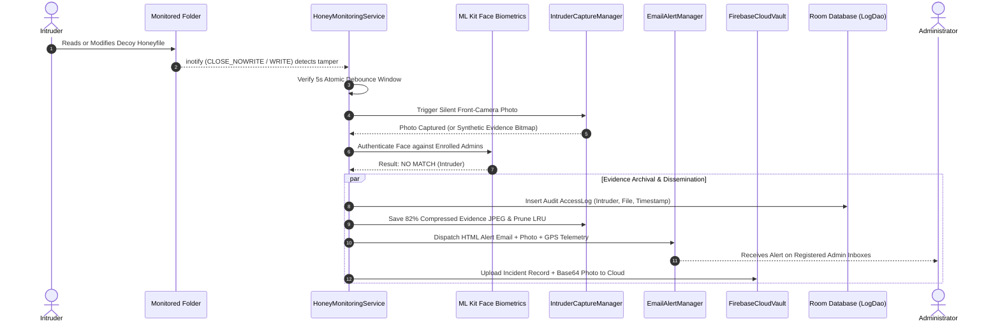

# 🛡️ Honeyfile Security — Deception & Intrusion Detection System

<p align="center">
  
</p>

<p align="center">
  <b>Next-Generation Honeypot Deception Engine, Biometric Facial Verification, and Real-Time File Integrity Surveillance for Android</b>
</p>

<p align="center">
  
  
  
  
  
  
</p>

---

## 📑 Table of Contents

1. [Executive Overview](#-executive-overview)
2. [Key Architectural Highlights & Capabilities](#-key-architectural-highlights--capabilities)
3. [Deception & Honeypot Philosophy](#-deception--honeypot-philosophy)
4. [Detailed System Architecture](#-detailed-system-architecture)
   - [1. Biometric Facial Authentication Subsystem](#1-biometric-facial-authentication-subsystem)
   - [2. Dual-Engine Directory & Integrity Surveillance](#2-dual-engine-directory--integrity-surveillance)
   - [3. Headless Foreground Surveillance & CameraX Engine](#3-headless-foreground-surveillance--camerax-engine)
   - [4. Foreground vs. Background Coordination (Handshake Architecture)](#4-foreground-vs-background-coordination-handshake-architecture)
   - [5. Intruder Evidence Capture & Forensic Photo Vault](#5-intruder-evidence-capture--forensic-photo-vault)
   - [6. Alert Dispatch & Forensic Device Telemetry](#6-alert-dispatch--forensic-device-telemetry)
   - [7. Cloud Vault Synchronization (Firestore & Auth)](#7-cloud-vault-synchronization-firestore--auth)
   - [8. Threat Analytics & Temporal Heatmap Intelligence](#8-threat-analytics--temporal-heatmap-intelligence)
   - [9. Room Database Audit Logging & Real-Time Search Ledger](#9-room-database-audit-logging--real-time-search-ledger)
   - [10. Decoy Studio & Honeyfile Synthesis Engine](#10-decoy-studio--honeyfile-synthesis-engine)
   - [11. Material 3 Expressive UI & Theming](#11-material-3-expressive-ui--theming)
   - [12. Performance, Battery & Storage Optimizations](#12-performance-battery--storage-optimizations)
5. [End-to-End Execution Flow (Sequence Diagram)](#-end-to-end-execution-flow)
6. [User Interface & Dashboard Walkthrough](#-user-interface--dashboard-walkthrough)
7. [Directory Structure & Code Map](#-directory-structure--code-map)
8. [Data Models & Schema Reference](#-data-models--schema-reference)
9. [Android Permissions & Security Policies](#-android-permissions--security-policies)
10. [Setup, Build & Deployment Guide](#-setup-build--deployment-guide)
11. [Configuration & Environment Parameters](#-configuration--environment-parameters)
12. [Project Credits & Attributions](#-project-credits--attributions)
13. [License & Ethical Security Use](#-license--ethical-security-use)

---

## 🌟 Executive Overview

**Honeyfile Security** is an enterprise-grade mobile endpoint security and cyber deception engineering application designed for the Android ecosystem. Operating on the proven principles of **cyber deception (Honeypotting)**, the application deploys realistic decoy documents (*honeyfiles*) containing simulated high-value targets (such as banking records, corporate non-disclosure agreements, tax filings, cryptocurrency seed backup ledgers, executive payroll sheets, cloud service account credentials, and database dumps) into monitored storage directories.

When unauthorized users or malicious processes interact with, open, modify, copy, rename, or delete these honeyfiles:
- The **stealth camera engine** silently captures a high-resolution facial photograph of the perpetrator via CameraX without triggering screen overlays, activity popups, or recents-list footprints.
- The **facial biometric engine** compares the captured image against enrolled Administrator profiles using on-device Machine Learning (Google ML Kit Face Detection) and scale-invariant geometric landmark ratios.
- The system collects **forensic device telemetry** (GPS geolocation coordinates, Google Maps pinpoint URL, local IPv4 address, connected Wi-Fi SSID, battery percentage, and charging state).
- An encrypted **HTML security alert email** containing the intruder's photo and exact location is dispatched immediately via SMTP to all registered administrator email addresses.
- The breach incident, metadata, and evidence snapshot are mirrored instantly to a remote **Firebase Cloud Firestore Vault** to prevent evidence loss even if the physical device is damaged or wiped.
- All events are permanently recorded in a local, indexed **Room Audit Database** and analyzed by the **Threat Analytics Engine** for threat scoring, peak attack windows, and 24-hour heatmaps.
- Multi-format decoy documents can be synthesized natively on demand (PDF, DOCX, XLSX, JSON, ENV, SQL) via the integrated **Decoy Studio**.

---

## 🚀 Key Architectural Highlights & Capabilities

| Feature Area | Technical Implementation | Security Advantage |
| :--- | :--- | :--- |
| **100% Jetpack Compose UI** | Material 3 Expressive design, Spring physics interactions, dynamic glowing risk borders, custom Canvas charts | Zero legacy XML view inflation overhead, fluid 60/120 FPS rendering, expressive tactile feedback. |
| **Facial Biometrics** | Unbundled Google ML Kit Face Detection + Normalized Landmark Geometry Ratio Analysis | On-device, sub-second facial verification; lazy-initialized for zero idle native memory allocation. |
| **Dual Admin Slots & Anti-Impersonation** | Independent Administrator profiles (Admin 1 & Admin 2) with distinct facial templates & emails | Multi-administrator governance; anti-impersonation cross-validation prevents duplicate face enrollments. |
| **Sole Admin Protection** | Deletion safeguards enforcing at least one active enrolled administrator profile | Prevents accidental system disarming and guarantees alert delivery continuity. |
| **Hybrid Surveillance** | Native Linux `inotify` (`FileObserver`) + Adaptive SAF Polling (60s active / 15s fallback) | Instant microsecond kernel detection for file reads (`CLOSE_NOWRITE`) and mutations with 75% reduced disk I/O. |
| **Headless Camera Capture** | CameraX `ImageCapture` bound directly to `LifecycleService` (`HoneyMonitoringService`) | 100% silent execution in background service — zero UI flashing, no activity popups or recents footprint. |
| **Foreground / Background Handshake** | Dynamic `MainActivity.isInForeground` coordination between Activity and Service | Prevents hardware camera lock contention and eliminates duplicate breach alert firing. |
| **Smart Debounce Engine** | 5s global atomic breach debounce + 6s per-file deletion debounce window | Prevents alert storming from rapid file operations and dual inotify/SAF delete notifications. |
| **Decoy Studio** | Native generator using Android `PdfDocument`, `ZipOutputStream` (OpenXML), and SQLite | Realistic multi-format honeyfiles (PDF, Word, Excel, SQL, JSON) without third-party document libraries. |
| **Deployment Suppression** | Concurrency flag `isDeploymentInProgress` with a 1.5s post-completion cooldown | Completely eliminates false-positive intrusion alerts during deliberate decoy generation. |
| **Forensic Telemetry** | GPS Geolocation, Google Maps URL, IPv4 address, Wi-Fi SSID, Battery percentage & charging state | Complete situational awareness for mobile forensic audit trails. |
| **Multi-Tier Email Alert** | JavaMail SMTP (TLS/SSL `smtp.gmail.com:465`) with CID inline image embedding | Real-time off-device notification delivered to all registered administrator inboxes. |
| **Off-Device Cloud Sync** | Firebase Anonymous Auth + Cloud Firestore document payload (Base64 JPEG) | Tamper-proof remote log persistence even if the local device is compromised or formatted. |
| **Threat Intelligence** | Dynamic 0–100 Threat Index, 6-slot 24h temporal heatmap, custom Compose Donut Chart | Real-time attack velocity analytics and risk categorization (Low, Elevated, Critical). |
| **Forensic Photo Vault** | Coil 2.6.0 async image pipeline, rolling LRU 100-photo retention, 82% optimized JPEG | Hardware bitmap acceleration, full-screen inspector, SAF external export, and bounded storage usage. |
| **Real-Time Audit Ledger** | Room DB v3 with composite indices (`file`, `timestamp`) & dynamic multi-field search | Instant filtering across file, action, user, and details with expandable forensic cards. |
| **Optimized Bytecode** | R8 full-mode shrinking, ProGuard stripping of all `android.util.Log` calls, resource exclusions | Stripped raw protobuf/metadata files, zero debug logging in production bytecode, minimal APK footprint. |

---

## 🍯 Deception & Honeypot Philosophy

Traditional mobile security relies on access control barriers (passwords, PINs, biometric locks) that alert an intruder when access is denied. **Honeyfile Security** utilizes an active deception strategy:

```
                              [ Monitored Directory ]
                                         │
                                         ▼
                      [ User / Process Interacts with Honeyfile ]
                                         │
                                         ▼
                        [ Background Silent Photo Capture ]
                                         │
                                         ▼
                       [ ML Kit Facial Ratio Verification ]
                                         │
                 ┌───────────────────────┴───────────────────────┐
                 ▼                                               ▼
         [ MATCH: Admin ]                               [ NO MATCH: Intruder ]
                 │                                               │
  • Authorized Access Verified                   • Silent Forensic Capture Executed
  • Logged in Room Database                      • Evidence Photo Saved to Vault
  • Live Dashboard Counters Updated              • Gather Forensic Telemetry (GPS, IP, Wi-Fi)
                                                 • Dispatch SMTP Email with Photo & Coordinates
                                                 • Mirror Incident to Firebase Cloud Vault
                                                 • Increment Threat Score & Heatmap Bins
```

---

## 🏗️ Detailed System Architecture

```
com.honeyfile.security
 ├── alert/         --> SMTP JavaMail Dispatcher & Device Telemetry Manager
 ├── analytics/     --> Threat Scoring, 24h Window Calculation & Heatmap Engine
 ├── auth/          --> Lazy ML Kit Facial Biometrics, Geometric Ratio Matcher & Theme Manager
 ├── camera/        --> CameraX Silent Capture, Synthetic Evidence Generator & LRU Pruning
 ├── cloud/         --> Firebase Firestore Cloud Vault Synchronizer & Anonymous Auth
 ├── data/          --> Room Database (v3 Indexed), AccessLog Entity & LogDao
 ├── decoy/         --> DecoyGeneratorEngine (Native PDF, OpenXML DOCX/XLSX, SQL/JSON)
 ├── integrity/     --> inotify FileObserver, SAF Path Resolver & Alteration Types
 ├── scanner/       --> Adaptive Directory Polling & Keyword Matching Engine
 ├── service/       --> HoneyMonitoringService Headless Foreground Surveillance Service
 └── ui/            --> MainActivity, Jetpack Compose Screens, Dialogs & Expressive Theme
```

---

### 1. Biometric Facial Authentication Subsystem
*Source: [`FaceAuthManager.kt`](app/src/main/java/com/honeyfile/security/auth/FaceAuthManager.kt)*

```
                       [ Captured Frame Bitmap ]
                                   │
                                   ▼
                   [ Lazy ML Kit FaceDetector Client ]
                   (Allocated only when biometrics run)
                                   │
                    (Detect Face Landmarks & Bounds)
                                   │
             ┌─────────────────────┴─────────────────────┐
             ▼                                           ▼
   [ Left / Right Eye Positions ]               [ Nose Base Position ]
             │                                           │
             └─────────────────────┬─────────────────────┘
                                   │
                                   ▼
                    [ Compute Scale-Invariant Ratios ]
               R1 = Eye_Distance / Bounding_Box_Width
               R2 = Eye_Nose_Distance / Bounding_Box_Height
                                   │
                                   ▼
                    [ Manhattan Distance Comparison ]
               Δ = |R1_captured - R1_enrolled| + |R2_captured - R2_enrolled|
                                   │
                     ┌─────────────┴─────────────┐
                     ▼                           ▼
               [ Δ < 0.12 ]                [ Δ >= 0.12 ]
              (Admin Match)                  (Intruder)
```

- **Mathematical Foundations:** Rather than relying on computationally heavy deep neural network embeddings that require hundreds of megabytes of RAM, the biometric engine extracts scale-invariant geometric proportions:
  $$\text{Inter-Pupillary Distance } (D_{\text{eyes}}) = \sqrt{(x_{\text{left}} - x_{\text{right}})^2 + (y_{\text{left}} - y_{\text{right}})^2}$$
  $$\text{Eye-to-Nose Distance } (D_{\text{eye-nose}}) = \sqrt{\left(\frac{x_{\text{left}} + x_{\text{right}}}{2} - x_{\text{nose}}\right)^2 + \left(\frac{y_{\text{left}} + y_{\text{right}}}{2} - y_{\text{nose}}\right)^2}$$
  $$R_1 = \frac{D_{\text{eyes}}}{\text{BoundingBox.Width}}, \quad R_2 = \frac{D_{\text{eye-nose}}}{\text{BoundingBox.Height}}$$
  $$\Delta = |R_{1,\text{captured}} - R_{1,\text{enrolled}}| + |R_{2,\text{captured}} - R_{2,\text{enrolled}}|$$
- **Lazy Client Allocation:** `FaceDetection.getClient(...)` is initialized via `by lazy`. Methods inspecting administrative names, email recipients, or enrollment status from `SharedPreferences` execute with **zero native ML Kit C++ memory overhead**.
- **Dual Administrator Profiles:** Supports independent profiles for Admin 1 and Admin 2 with distinct names, notification email addresses, and facial landmark templates.
- **Anti-Impersonation Safeguards:**
  - When enrolling Admin 2, the facial scan is cross-checked against Admin 1's profile. If $\Delta < 0.12$, enrollment is rejected to prevent duplicate face registrations.
  - Distinct identity validation: Prevents sharing administrator names or notification emails across slots.
- **Sole Administrator Protection:**
  - Surveillance services require at least one active administrator profile to operate (`hasAtLeastOneAdmin()`).
  - Clearing Admin 1 is blocked if no Admin 2 exists, preventing an unmonitored or un-administrated state.
- **Mandatory First-Run Enrollment:** If no administrator is registered upon launching the app, a mandatory enrollment flow intercepts the user before surveillance can be armed.

---

### 2. Dual-Engine Directory & Integrity Surveillance
*Sources: [`FolderScannerManager.kt`](app/src/main/java/com/honeyfile/security/scanner/FolderScannerManager.kt), [`HoneyFileObserver.kt`](app/src/main/java/com/honeyfile/security/integrity/HoneyFileObserver.kt), [`UriPathResolver.kt`](app/src/main/java/com/honeyfile/security/integrity/UriPathResolver.kt)*

```
                                [ Monitored Storage Location ]
                                               │
                       ┌───────────────────────┴───────────────────────┐
                       ▼                                               ▼
        [ Linux Kernel inotify Observer ]              [ Adaptive SAF Polling Engine ]
        • Microsecond Event Triggers                   • 60s delay when inotify active
        • Uses Android FileObserver                    • 15s delay in fallback mode
        • Detects Reads (CLOSE_NOWRITE)                • Uses DocumentFile.fromTreeUri
        • Detects Writes (CREATE, MODIFY,              • Keeps UI file counts synchronized
          DELETE, ATTRIB, MOVED_FROM/TO)               • Zero flash storage hammering
```

- **Read Detection Strategy:** Android's Storage Access Framework (SAF) does not provide read notification hooks. `HoneyFileObserver` hooks directly into the Linux kernel `FileObserver` listening for the `CLOSE_NOWRITE` mask, detecting when an intruder opens and reads a honeyfile without saving modifications.
- **Tracked Kernel Event Masks:**
  - `CLOSE_NOWRITE`: Honeyfile opened and closed without modifications (Read access).
  - `MODIFY`, `CLOSE_WRITE`: File content altered or updated.
  - `CREATE`, `MOVED_TO`: New file created or moved into directory.
  - `DELETE`, `DELETE_SELF`, `MOVED_FROM`: File deleted or removed from directory.
  - `ATTRIB`: Metadata, timestamps, or file permission changes.
- **Adaptive Storage Polling:** When Linux inotify is active, SAF background polling automatically relaxes from 15s to 60s, cutting disk read cycles and garbage collection churn by 75% while preserving instant, real-time alert dispatching.
- **Keyword Filtering:** Events are evaluated against sensitive decoy keywords:
  `honey`, `secret`, `password`, `confidential`, `salary`, `admin`, `credential`, `private`, `decoy`, `backup`, `api_key`, `token`, `apk`, `tax`, `ledger`, `vault`, `env`.
- **Path Resolution:** `UriPathResolver` decomposes SAF tree document identifiers into absolute Linux directory paths (`/storage/emulated/0/...`), gracefully resolving secondary SD card paths and non-standard mount paths.

---

### 3. Headless Foreground Surveillance & CameraX Engine
*Source: [`HoneyMonitoringService.kt`](app/src/main/java/com/honeyfile/security/service/HoneyMonitoringService.kt)*

- **Android 14 Compliance:** Operates as an official Android `ForegroundService` declaring both `FOREGROUND_SERVICE_TYPE_CAMERA` and `FOREGROUND_SERVICE_TYPE_SPECIAL_USE`.
- **Headless Execution:** CameraX `ImageCapture` is bound directly to the service's `LifecycleService`. Silent captures occur entirely headlessly in the background—no transparent activities, no screen overlays, and no UI flashing.
- **Dual Notification Channels:**
  - `honey_monitor_channel` (Importance Low/None): Persistent low-profile status notification indicating active honeypot protection.
  - `honey_alert_channel` (Importance High): Real-time heads-up breach notification with vibration and alert sound when an intrusion is detected.
- **Single Event Collector Lifecycle:** Tracks `eventsCollectionJob`, canceling prior collectors before launching in `onStartCommand()`, and canceling upon `onDestroy()` to prevent redundant coroutines.
- **Thread-Safe Debouncing:**
  - Global 5-second atomic debounce (`BREACH_DEBOUNCE_MS = 5000L`) preventing alert floods.
  - Per-file 6-second deletion debounce (`recentDeletedBreaches[fileName]`) eliminating duplicate delete alerts triggered simultaneously by inotify and SAF.

---

### 4. Foreground vs. Background Coordination (Handshake Architecture)
*Sources: [`MainActivity.kt`](app/src/main/java/com/honeyfile/security/ui/MainActivity.kt), [`HoneyMonitoringService.kt`](app/src/main/java/com/honeyfile/security/service/HoneyMonitoringService.kt)*

To prevent camera hardware lock contention and duplicate alert execution when the user is actively interacting with the application:

```
[ File Tamper Event Detected ]
               │
               ▼
   [ Check MainActivity.isInForeground ]
               │
       ┌───────┴───────┐
       ▼               ▼
    [ TRUE ]       [ FALSE ]
       │               │
• App is open in UI • Phone locked or app in background
• Service skips     • HoneyMonitoringService handles capture
  camera capture    • Silent CameraX ImageCapture executed
• MainActivity      • Facial ML Kit verification run
  handles breach    • SMTP alert email dispatched
• Prevents camera   • Evidence mirrored to Firestore Cloud Vault
  hardware locks    • Audit logged to Room Database
```

- **Foreground Handshake (`isInForeground`):** When `MainActivity` is active in the foreground (`onResume()`), `HoneyMonitoringService` skips background camera captures and delegates breach handling to `MainActivity`.
- **Background Autonomy:** When the application is minimized, backgrounded, or the screen is turned off (`onStop()`), `HoneyMonitoringService` autonomously manages CameraX silent captures, biometric comparisons, SMTP alert dispatches, and cloud synchronization.

---

### 5. Intruder Evidence Capture & Forensic Photo Vault
*Sources: [`IntruderCaptureManager.kt`](app/src/main/java/com/honeyfile/security/camera/IntruderCaptureManager.kt), [`VaultScreen.kt`](app/src/main/java/com/honeyfile/security/ui/compose/VaultScreen.kt), [`PhotoDetailDialog.kt`](app/src/main/java/com/honeyfile/security/ui/compose/dialogs/PhotoDetailDialog.kt)*

- **Capture Pipeline:**
  1. **In-Memory Capture:** Direct byte-buffer extraction from `ImageProxy` via `BitmapFactory.decodeByteArray` with rotation matrix compensation.
  2. **File Capture Fallback:** Uses `ImageCapture.OutputFileOptions` to write a temporary JPEG in `cacheDir` and applies EXIF orientation parsing.
  3. **Synthetic Evidence Generation:** If the hardware camera is unavailable or fails, a structured high-contrast canvas alert bitmap containing the breach timestamp, altered file name, device model, and incident metadata is generated automatically.
- **Storage Optimization:**
  - Images are compressed at **82% JPEG quality**, saving ~40% file size per snapshot with zero perceptible degradation.
  - Implements an automated **rolling LRU retention cap (100 photos)** (`pruneOldEvidence()`), keeping internal storage bounded.
- **Compose Vault Screen:**
  - Rendered with **Coil 2.6.0** with hardware bitmap acceleration and instant caching.
  - 2-column grid layout with floating red timestamp pills and evidence count badges.
  - Full-screen zoomable inspection dialog (`PhotoDetailDialog`):
    - High-resolution preview with incident metadata (timestamp, file name, file size in KB).
    - **SAF External Export:** Uses `ActivityResultContracts.CreateDocument("image/jpeg")` to export snapshots to public Downloads or Pictures folders.
    - **Android Sharesheet:** Integrates with `FileProvider` (`content://...`) to share evidence images across external applications.
    - **Permanent Deletion:** Confirmed deletion from internal storage with immediate UI refresh.

---

### 6. Alert Dispatch & Forensic Device Telemetry
*Sources: [`EmailAlertManager.kt`](app/src/main/java/com/honeyfile/security/alert/EmailAlertManager.kt), [`TelemetryManager.kt`](app/src/main/java/com/honeyfile/security/alert/TelemetryManager.kt)*

```
                              [ Security Alert Triggered ]
                                            │
                                            ▼
                              [ Gather Device Telemetry ]
               ├── GPS Coordinates (Latitude, Longitude, Accuracy)
               ├── Google Maps Pinpoint Hyperlink
               ├── Network IPv4 Address (NetworkInterface scan)
               ├── Connected Wi-Fi SSID / Connection Type
               └── Battery Percentage & Charging State
                                            │
                                            ▼
                             [ Compose HTML Email Payload ]
               ├── Incident Subject & Severity Badge
               ├── Timestamp & Altered File Name
               ├── Formatted Telemetry Information Card
               └── Embedded JPEG Intruder Evidence Photo (CID: <intruder_photo>)
                                            │
                                            ▼
                           [ SMTP SSL Dispatch (Port 465) ]
               └── Delivered Simultaneously to all Enrolled Admin Inboxes
```

- **Dual-Provider Geolocation:** Evaluates both `LocationManager.GPS_PROVIDER` and `LocationManager.NETWORK_PROVIDER` to select the freshest, highest-accuracy geographical fix.
- **Direct Maps URL:** Generates direct pinpoint hyperlinks formatted as `https://maps.google.com/?q={latitude},{longitude}`.
- **Local Network Auditing:** Iterates device network interfaces, filtering loopback adapters, to log the active local IPv4 address and Wi-Fi SSID.
- **Power State Telemetry:** Captures battery charge percentage and detects active AC/USB charging states via `Intent.ACTION_BATTERY_CHANGED`.
- **Multi-Recipient SMTP:** Dispatches formatted HTML alerts with inline CID-embedded JPEG evidence photos to all enrolled administrator email inboxes simultaneously.

---

### 7. Cloud Vault Synchronization (Firestore & Auth)
*Source: [`FirebaseCloudVaultManager.kt`](app/src/main/java/com/honeyfile/security/cloud/FirebaseCloudVaultManager.kt)*

To safeguard audit records against local device tampering or formatting, every breach incident is mirrored to **Firebase Cloud Firestore**:

- **Authentication:** Uses Firebase Anonymous Authentication (`signInAnonymously()`) for secure, zero-friction cloud sessions.
- **Firestore Schema (`breach_incidents` Collection):**

```json
{
  "file_name": "Chase_Premier_Statement_Q3_2026.pdf",
  "action_type": "BREACH",
  "timestamp": "2026-09-21 12:30:00",
  "details": "UNAUTHORIZED INTRUSION: File 'Chase_Premier_Statement_Q3_2026.pdf' accessed by Intruder.",
  "photo_base64": "/9j/4AAQSkZJRgABAQAAAQABAAD/2wBD...",
  "device_model": "Google Pixel 8 Pro",
  "android_version": "Android 14 (API 34)",
  "synced_at_ms": 1789974600000,
  "telemetry": {
    "latitude": 19.0760,
    "longitude": 72.8777,
    "google_maps_url": "https://maps.google.com/?q=19.0760,72.8777",
    "ip_address": "192.168.1.45",
    "wifi_ssid": "Corporate_Secure_5G",
    "battery_percentage": 87,
    "is_charging": true
  }
}
```

- **Offline Resilience:** If Firebase credentials are not supplied or the device is offline, cloud synchronization gracefully skips without impacting local monitoring or SMTP alert dispatching.

---

### 8. Threat Analytics & Temporal Heatmap Intelligence
*Sources: [`ThreatAnalyticsManager.kt`](app/src/main/java/com/honeyfile/security/analytics/ThreatAnalyticsManager.kt), [`ThreatSummary.kt`](app/src/main/java/com/honeyfile/security/analytics/ThreatSummary.kt), [`ThreatAnalyticsDetailDialog.kt`](app/src/main/java/com/honeyfile/security/ui/compose/dialogs/ThreatAnalyticsDetailDialog.kt)*

```
                            [ Historical Access Logs ]
                                        │
                                        ▼
                      [ ThreatAnalyticsManager Engine ]
                                        │
             ┌──────────────────────────┼──────────────────────────┐
             ▼                          ▼                          ▼
   [ 24h Velocity Score ]    [ Peak Attack Window ]       [ 6-Slot Heatmap ]
   • Count in last 24h       • 24-hour histogram binning  • 00:00 - 04:00 (Slot 0)
   • 0 breaches  -> 5/100    • Identifies highest         • 04:00 - 08:00 (Slot 1)
   • All-time    -> 20/100     frequency 2-hour window    • 08:00 - 12:00 (Slot 2)
   • 1-2 in 24h  -> 55/100     (e.g., "14:00 - 16:00")    • 12:00 - 16:00 (Slot 3)
   • >= 3 in 24h -> 95/100                                • 16:00 - 20:00 (Slot 4)
                                                          • 20:00 - 24:00 (Slot 5)
```

- **Severity Scoring Algorithm:**
  $$\text{Score} = \begin{cases} 95, & \text{Breaches}_{24\text{h}} \ge 3 \implies \textbf{CRITICAL} \\ 55, & \text{Breaches}_{24\text{h}} \in [1, 2] \implies \textbf{ELEVATED} \\ 20, & \text{Breaches}_{\text{all-time}} > 0 \implies \textbf{LOW} \\ 5, & \text{Breaches}_{\text{all-time}} = 0 \implies \textbf{LOW} \end{cases}$$
- **Allocation-Free Peak Attack Window:** Uses fast string slicing on timestamps (`substringAfter(" ").substringBefore(":")`) to populate a 24-hour histogram (`hourCounts[0..23]`) without `Calendar` object churn. Identifies the maximum breach hour and formats the window as `HH:00 - (HH+2):00`. Returns `"None Detected"` if zero breaches exist.
- **6-Slot Heatmap Color Thresholds:** Binned into 4-hour slots with exact visual thresholds:
  - $\ge 3$ breaches: Solid Vivid Red (`#DC2626`)
  - 1–2 breaches: Solid Vivid Amber (`#D97706`)
  - 0 breaches: Solid Vivid Green (`#16A34A`)
- **Custom Hardware-Accelerated Canvas Donut Chart:** Interactive Compose chart rendering distribution across:
  - Authorized Admin Access (Green)
  - Intruder Breaches (Red)
  - File Modifications (Amber)
  - File Deletions (Purple)
  - New Files Created (Cyan)

---

### 9. Room Database Audit Logging & Real-Time Search Ledger
*Sources: [`AppDatabase.kt`](app/src/main/java/com/honeyfile/security/data/AppDatabase.kt), [`LogDao.kt`](app/src/main/java/com/honeyfile/security/data/LogDao.kt), [`AccessLog.kt`](app/src/main/java/com/honeyfile/security/data/AccessLog.kt), [`LogsScreen.kt`](app/src/main/java/com/honeyfile/security/ui/compose/LogsScreen.kt)*

- **Persistence Layer:** Android Room Database 2.6.1 (schema version 3) with SQLite database `honeyfile_logs.db`.
- **Database Indices:** Table `access_logs` includes composite B-tree indices on `file` and `timestamp`, ensuring sub-millisecond indexed queries instead of sequential table scans.
- **Live Search Filtering:** Real-time query matching across target file name, action type, actor identity, and technical details.
- **Expandable Telemetry Cards:** Tapping any log card triggers an M3 spring animation (`expressiveBounceClickable`) expanding the card to reveal the full forensic telemetry summary, device metadata, and timestamp.

---

### 10. Decoy Studio & Honeyfile Synthesis Engine
*Sources: [`DecoyGeneratorEngine.kt`](app/src/main/java/com/honeyfile/security/decoy/DecoyGeneratorEngine.kt), [`DecoyStudioSheet.kt`](app/src/main/java/com/honeyfile/security/ui/compose/dialogs/DecoyStudioSheet.kt)*

Administrators can deploy realistic, multi-format honeyfiles directly into any monitored folder via the built-in **Decoy Studio**:

- **Native Synthesis (Zero Third-Party Libraries):**
  - **PDF Documents:** Synthesized via Android SDK `android.graphics.pdf.PdfDocument`, utilizing Canvas graphics, typography, headers, line dividers, and colored transaction tables.
  - **Word Documents (`.docx`):** Built programmatically using `ZipOutputStream` assembling valid OpenXML packages (`[Content_Types].xml`, `_rels/.rels`, `word/document.xml`).
  - **Excel Spreadsheets (`.xlsx`):** Built programmatically using `ZipOutputStream` assembling valid OpenXML spreadsheet structures (`xl/workbook.xml`, `xl/worksheets/sheet1.xml`).
  - **Developer Artifacts (`.json`, `.env`, `.sql`):** Generates realistic GCP service account keys, production `.env` credentials, and MySQL/MariaDB database schema dumps with hashed credentials.

#### Decoy Studio Template Catalog

| Category | File Name | MIME Type | Simulated Content Details |
| :--- | :--- | :--- | :--- |
| **PDFs** | `Chase_Premier_Statement_Q3_2026.pdf` | `application/pdf` | Chase Premier Banking statement with opening/closing balances, salary credits, debit ledgers, and account numbers. |
| **PDFs** | `NDA_Confidential_Agreement_2026.pdf` | `application/pdf` | Corporate Non-Disclosure Agreement with legal provisions, \$500,000 liquidated damages clause, and signatures. |
| **PDFs** | `ITR_2025_Tax_Assessment.pdf` | `application/pdf` | Indian Income Tax Return Form ITR-2 with gross income breakdown, tax deductions, and refund due amounts. |
| **Office Docs** | `Crypto_Seed_Backup_Ledger.docx` | `application/octet-stream` | OpenXML Word document containing Ledger Nano X Bitcoin, Ethereum, and Solana 24-word seed phrases and PINs. |
| **Office Docs** | `Payroll_Q3_2026_Confidential.xlsx` | `application/octet-stream` | OpenXML Excel spreadsheet listing executive compensation, designations, allowances, and CTC figures. |
| **Dev & Database** | `gcp_service_account_prod.json` | `application/json` | Google Cloud IAM service account credential file with RSA private keys, client email, Stripe key, and AWS key. |
| **Dev & Database** | `app_secrets.env` | `text/plain` | Production environment configuration with database host/port/credentials, Firebase secrets, and Stripe keys. |
| **Dev & Database** | `database_backup.sql` | `text/plain` | SQL schema dump creating `system_credentials` table populated with bcrypt-hashed passwords and root API tokens. |

- **UI & Deployment Features:**
  - Category filter pills (`All`, `PDFs`, `Office Docs`, `Dev & Database`).
  - "Select All" and "Deselect All" quick buttons.
  - Duplicate detection: Checks `docDir.findFile(template.fileName)` to skip already existing files without overwriting.
  - Linear progress bar with live template generation status text.
  - **False-Positive Alert Suppression:** Sets `FolderScannerManager.isDeploymentInProgress` and `HoneyFileObserver.isDeploymentInProgress` to `true` with a 1.5-second post-completion grace period, ensuring intentional decoy generation does not trigger intrusion alarms.

---

### 11. Material 3 Expressive UI & Theming
*Sources: [`HoneyTheme.kt`](app/src/main/java/com/honeyfile/security/ui/theme/Theme.kt), [`HoneyIcons.kt`](app/src/main/java/com/honeyfile/security/ui/theme/HoneyIcons.kt), [`ThemeManager.kt`](app/src/main/java/com/honeyfile/security/auth/ThemeManager.kt)*

- **Material 3 Expressive Design:** Spring physics click interactions (`expressiveBounceClickable`), glowing border animations, high-contrast container surfaces, and pill badges.
- **Native Vector Iconography:** Pure inline Compose `ImageVector` definitions in `HoneyIcons.kt` (Shield, FolderSpecial, Analytics, ElectricBolt, People, Lock, KeyboardArrowUp, KeyboardArrowDown, FileDownload, Visibility) eliminating vector XML inflation overhead.
- **Dynamic Dark/Light Mode:** In-place theme switching via Compose reactive state holders without Activity recreation, preserving active camera sessions and folder observation.

---

### 12. Performance, Battery & Storage Optimizations

1. **Lazy ML Kit Initialization:** `FaceDetector` is initialized on-demand; reading admin metadata and email settings runs with 0 MB native ML Kit memory footprint.
2. **Adaptive Storage Polling:** SAF directory scanning relaxes to 60s when Linux kernel `inotify` is active, cutting storage wakeups by 75%.
3. **Room Query Memoization:** LiveData query streams in Compose root are memoized via `remember { ... }`, eliminating query recreation during recompositions.
4. **LRU Photo Pruning:** Automatically retains the most recent 100 evidence snapshots, preventing unbounded disk growth.
5. **Bytecode Log Stripping:** R8 ProGuard rules strip all `android.util.Log` calls (`Log.d`, `Log.v`, `Log.i`) and string constants from the compiled APK.
6. **Packaging Exclusions:** Excludes raw `.proto` schema files, `META-INF/*.version` text files, and debug probe binaries from the APK archive.
7. **Thread-Safe Breach Debouncing:** 5-second atomic debounce and 6-second per-file deletion debounce eliminate alert storming and redundant capture coroutines.

---

## 🔄 End-to-End Execution Flow



---

## 📱 User Interface & Dashboard Walkthrough

The application features an intuitive 4-tab bottom navigation bar built entirely with Jetpack Compose:

```
┌─────────────────────────────────────────────────────────────┐
│ HONEYFILE SECURITY                          [Dark Mode: ON] │
│ Endpoint Honeypot & Intrusion Surveillance                  │
├─────────────────────────────────────────────────────────────┤
│                                                             │
│    [Overview]       [Scanner]       [Vault]       [Logs]    │
│                                                             │
│  ┌──────────────────────────┐ ┌──────────────────────────┐  │
│  │ Admin Passes: 12         │ │ Intruder Breaches: 3     │  │
│  └──────────────────────────┘ └──────────────────────────┘  │
│                                                             │
│  ┌───────────────────────────────────────────────────────┐  │
│  │ [!] Endpoint Risk Index: CRITICAL                     │  │
│  │ Threat Score: 95/100                                  │  │
│  │ Peak: 14:00 - 16:00 | Breaches in 24h: 3              │  │
│  │ [ View Analytics & Heatmap ]                          │  │
│  └───────────────────────────────────────────────────────┘  │
│                                                             │
│  Security Management:                                       │
│  ┌──────────────────────────┐ ┌──────────────────────────┐  │
│  │ Deploy Decoy Traps       │ │ Manage Admins            │  │
│  │ Multi-Format Traps       │ │ Biometric Profiles       │  │
│  └──────────────────────────┘ └──────────────────────────┘  │
│                                                             │
│  ┌───────────────────────────────────────────────────────┐  │
│  │ [i] About & Credits (v1.0.2 Architecture)             │  │
│  └───────────────────────────────────────────────────────┘  │
│                                                             │
└─────────────────────────────────────────────────────────────┘
```

1. **Overview Screen (`OverviewScreen.kt`):**
   - **Overview Stats Cards**: Dual M3 Expressive counters showing authorized Admin Passes and Intruder Breaches.
   - **Risk Index Card**: Animated pulsing glow border reflecting real-time severity (Low 🟢, Elevated 🟡, Critical 🔴) with linear progress bar.
   - **Analytics Modal**: Tap "View Analytics & Heatmap" to view the interactive 6-slot 24h heatmap and custom Compose Donut Chart.
   - **Quick Actions**: Dual action tiles for **Deploy Decoy** (launches Decoy Studio) and **Manage Admins** (biometric profile editor), and an **About & Credits** tile.
2. **Scanner Screen (`ScannerScreen.kt`):**
   - Directory selection via Storage Access Framework (`OpenDocumentTree`).
   - Continuous background surveillance switch with live status badge.
   - Monitored files and honeyfile counters.
   - Live file modification feed with category filter chips (`ALL`, `NEW`, `EDITED`, `DELETED`, `ACCESSED`, `BREACHES`).
3. **Photo Vault Screen (`VaultScreen.kt`):**
   - 2-column evidence photo grid with Coil async loading and hardware bitmap caching.
   - Floating timestamp pills on each image card and total evidence count badge.
   - Fullscreen zoomable inspection modal with evidence sharing via Sharesheet, external storage export via SAF, and permanent deletion.
4. **Audit Logs Screen (`LogsScreen.kt`):**
   - Complete audit trail of endpoint interactions.
   - Live real-time search filtering across filename, action, identity, and details.
   - Expandable M3 cards with spring animations displaying full device telemetry.

---

## 📂 Directory Structure & Code Map

```
app/src/main/
├── AndroidManifest.xml                          # Permissions, service declaration & FileProvider
├── java/com/honeyfile/security/
│   ├── alert/
│   │   ├── EmailAlertManager.kt                 # JavaMail SMTP TLS engine with inline photo attachment
│   │   └── TelemetryManager.kt                  # GPS, IPv4, Wi-Fi SSID & battery state collector
│   ├── analytics/
│   │   ├── ThreatAnalyticsManager.kt            # Threat scoring, peak hour & heatmap analysis
│   │   └── ThreatSummary.kt                     # Analytics domain data models & severity enums
│   ├── auth/
│   │   ├── FaceAuthManager.kt                   # Lazy ML Kit facial landmark ratio matching engine
│   │   └── ThemeManager.kt                      # Persistent SharedPreferences theme preference manager
│   ├── camera/
│   │   └── IntruderCaptureManager.kt            # Silent camera capture, fallback bitmap generator, LRU pruning
│   ├── cloud/
│   │   └── FirebaseCloudVaultManager.kt         # Firestore sync & anonymous authentication
│   ├── data/
│   │   ├── AccessLog.kt                         # Room entity (v3) with composite indices (file, timestamp)
│   │   ├── AppDatabase.kt                       # Room database configuration (version 3)
│   │   └── LogDao.kt                            # Room Data Access Object queries
│   ├── decoy/
│   │   └── DecoyGeneratorEngine.kt              # Native generator (PDF, OpenXML DOCX/XLSX, SQL/JSON)
│   ├── integrity/
│   │   ├── FileAlterationEvent.kt               # Alteration event data models & types
│   │   ├── HoneyFileObserver.kt                 # Linux inotify file observer for read/write events
│   │   └── UriPathResolver.kt                   # SAF content:// URI to Linux path converter
│   ├── scanner/
│   │   └── FolderScannerManager.kt              # Adaptive directory scanner (inotify + SAF polling)
│   ├── service/
│   │   └── HoneyMonitoringService.kt            # Headless foreground surveillance service with CameraX
│   └── ui/
│       ├── MainActivity.kt                      # Compose root host, lifecycle & permission manager
│       ├── compose/
│       │   ├── HoneyfileApp.kt                  # Root Compose scaffold, tab transitions & navigation
│       │   ├── OverviewScreen.kt                # Material 3 Expressive overview & quick actions
│       │   ├── ScannerScreen.kt                 # Directory picker, live event feed & filter chips
│       │   ├── VaultScreen.kt                   # Evidence photo grid with Coil AsyncImage
│       │   ├── LogsScreen.kt                    # Audit log timeline with live search filtering
│       │   └── dialogs/
│       │       ├── AboutCreditsDialog.kt        # Architecture, attributions & version modal
│       │       ├── AdminEnrollScanDialog.kt     # Live camera dialog for admin face registration
│       │       ├── AdminManagementDialog.kt     # Admin profile management modal (add/edit/delete)
│       │       ├── DecoyStudioSheet.kt          # Multi-format decoy generator bottom sheet
│       │       ├── PhotoDetailDialog.kt         # Fullscreen evidence inspector & export tool
│       │       └── ThreatAnalyticsDetailDialog.kt # Interactive threat breakdown & Canvas Donut Chart
│       └── theme/
│           ├── Color.kt                         # Cyber Green, Alert Red, Cyan Neon & Dark palettes
│           ├── HoneyIcons.kt                    # Pure inline ImageVector definitions
│           ├── Shape.kt                         # Expressive container, pill & card shapes
│           ├── Theme.kt                         # HoneyTheme Compose Material 3 color schemes
│           └── Typography.kt                    # Monospace telemetry & bold headline typography
└── res/                                         # Drawables, mipmaps, XML file paths & strings
```

---

## 📊 Data Models & Schema Reference

### 1. `AccessLog` (Room Database Entity — Schema v3)
```kotlin
@Entity(
    tableName = "access_logs",
    indices = [
        Index(value = ["file"]),
        Index(value = ["timestamp"])
    ]
)
data class AccessLog(
    @PrimaryKey(autoGenerate = true)
    val id: Long = 0,
    val file: String,        // Target honeyfile or modified file name
    val user: String,        // Identity: "Admin 1", "Admin 2", "Intruder", "System"
    val action: String,      // Action: "ACCESS", "BREACH", "CREATED", "MODIFIED", "DELETED", "RENAMED"
    val details: String,     // Human-readable change details and telemetry summary
    val timestamp: String    // Formatted timestamp: "yyyy-MM-dd HH:mm:ss"
)
```

### 2. `DeviceTelemetry`
```kotlin
data class DeviceTelemetry(
    val latitude: Double?,
    val longitude: Double?,
    val googleMapsUrl: String?,
    val ipAddress: String,
    val wifiSsid: String,
    val batteryPercentage: Int,
    val isCharging: Boolean,
    val formattedSummary: String
)
```

### 3. `ThreatSummary`
```kotlin
enum class SeverityLevel { LOW, ELEVATED, CRITICAL }

data class HeatmapSlot(
    val timeLabel: String,         // "00-04h", "04-08h", etc.
    val count: Int,                // Breach count in slot
    val intensityColorHex: String  // Hex code: #16A34A (Green), #D97706 (Amber), #DC2626 (Red)
)

data class ThreatSummary(
    val severityLevel: SeverityLevel,
    val threatScore: Int,                   // 0 to 100
    val peakAttackTimeWindow: String,       // e.g. "14:00 - 16:00"
    val totalIntruderAttempts24h: Int,
    val totalIntruderAttemptsAllTime: Int,
    val heatmapSlots: List<HeatmapSlot>
)
```

### 4. `DecoyTemplate`
```kotlin
data class DecoyTemplate(
    val fileName: String,
    val mimeType: String,
    val category: DecoyCategory,
    val displayName: String,
    val emoji: String
)

enum class DecoyCategory(val label: String) {
    PDF("PDFs"),
    OFFICE("Office Docs"),
    DATABASE("Dev & Database")
}
```

---

## 🔒 Android Permissions & Security Policies

| Permission | Usage Description |
| :--- | :--- |
| `android.permission.CAMERA` | Captures facial biometric frames during admin enrollment and takes silent photos during intrusion events. |
| `android.permission.INTERNET` | Dispatches SMTP alert emails to administrators and syncs breach incidents with Firebase Cloud Firestore. |
| `android.permission.ACCESS_NETWORK_STATE` | Inspects network connectivity to identify IP routing state. |
| `android.permission.ACCESS_WIFI_STATE` | Retrieves active Wi-Fi SSID for forensic device telemetry. |
| `android.permission.ACCESS_FINE_LOCATION` | Captures high-precision GPS coordinates during security breaches. |
| `android.permission.ACCESS_COARSE_LOCATION` | Fallback network-based geolocation provider. |
| `android.permission.POST_NOTIFICATIONS` | Displays real-time breach notifications and foreground service status (Android 13+). |
| `android.permission.READ_MEDIA_IMAGES` | Scans and displays captured photos in the evidence vault (Android 13+). |
| `android.permission.FOREGROUND_SERVICE` | Keeps the background surveillance engine running continuously. |
| `android.permission.FOREGROUND_SERVICE_CAMERA` | Declares camera usage in foreground service mode for Android 14 compliance. |
| `android.permission.FOREGROUND_SERVICE_SPECIAL_USE` | Declares Continuous Honeypot Security Monitoring service subtype. |

---

## 🛠️ Setup, Build & Deployment Guide

### Prerequisites
- **Android Studio:** Hedgehog (2023.1.1) or newer
- **JDK:** Java Development Kit 17
- **Android SDK:** Compile SDK 34, Target SDK 30, Min SDK 24
- **Google Play Services:** Required on target device or emulator for unbundled ML Kit Face Detection

### Step-by-Step Instructions

1. **Clone the Repository:**
   ```bash
   git clone https://github.com/mayuresh2543/honey.git
   cd honey
   ```

2. **Configure Firebase (Optional for Cloud Sync):**
   - Place your `google-services.json` inside the `app/` directory.
   - Enable **Cloud Firestore** and **Anonymous Authentication** in your Firebase Console.
   *(If omitted, the app operates in local-only mode and gracefully skips cloud synchronization).*

3. **Build Debug APK:**
   ```bash
   ./gradlew assembleDebug
   ```

4. **Install on Device / Emulator:**
   ```bash
   adb install app/build/outputs/apk/debug/app-debug.apk
   ```

5. **Initial Setup Flow:**
   - On initial launch, grant **Camera**, **Location**, and **Notification** permissions.
   - Complete the **Mandatory Admin 1 Enrollment Dialog**: align your face with the camera, capture the scan, and enter your name and alert email.
   - In the **Scanner** tab, tap **"Choose Directory to Monitor"** and select a folder (e.g., `Documents` or `Downloads`).
   - In the **Overview** tab, tap **"Deploy Decoy"** to open **Decoy Studio** and deploy synthetic honeyfiles into your monitored directory.
   - Enable **"Continuous Auto-Scan"** in the Scanner tab to activate the background surveillance service.

---

## ⚙️ Configuration & Environment Parameters

| Parameter | Location | Default Value | Description |
| :--- | :--- | :--- | :--- |
| `BREACH_DEBOUNCE_MS` | `HoneyMonitoringService.kt` | `5000L` (5s) | Cooldown window preventing duplicate alert bursts. |
| `DELETED_BREACH_DEBOUNCE_MS` | `HoneyMonitoringService.kt` | `6000L` (6s) | Per-file deletion cooldown window preventing duplicate delete alerts. |
| `SCAN_INTERVAL_INOTIFY` | `FolderScannerManager.kt` | `60000L` (60s) | Adaptive periodic SAF directory polling interval when inotify is active. |
| `SCAN_INTERVAL_FALLBACK`| `FolderScannerManager.kt` | `15000L` (15s) | Periodic SAF directory polling interval in fallback mode. |
| `MAX_VAULT_PHOTOS` | `IntruderCaptureManager.kt` | `100` | Rolling LRU maximum retention cap for captured evidence photos. |
| `JPEG_QUALITY` | `IntruderCaptureManager.kt` | `82` | Optimized JPEG compression quality for evidence snapshots. |
| `BIOMETRIC_DIFF_THRESHOLD` | `FaceAuthManager.kt` | `0.12f` | Maximum Manhattan ratio delta for facial authentication match. |
| `SMTP_HOST` | `EmailAlertManager.kt` | `smtp.gmail.com` | SMTP relay server for alert notifications. |
| `SMTP_PORT` | `EmailAlertManager.kt` | `465` (SSL) | Secure SMTP port. |

---

## 👨‍💻 Project Credits & Attributions

- **Mayuresh Nanal** — *Lead Security Architect & Engineering Lead*
- **Anirudh Kewat** — *Core Systems & Detection Engineer*

---

## ⚖️ License & Ethical Security Use

This software is developed for **defensive security monitoring, academic research, and personal endpoint protection**. It is designed to detect unauthorized access to personal or enterprise data on Android devices. Ensure compliance with all applicable local privacy laws and organizational policies regarding automated photography and location telemetry collection.

---

<p align="center">
  <b>Honeyfile Security</b> — <i>Active Cyber Deception & Endpoint Protection</i>
</p>
